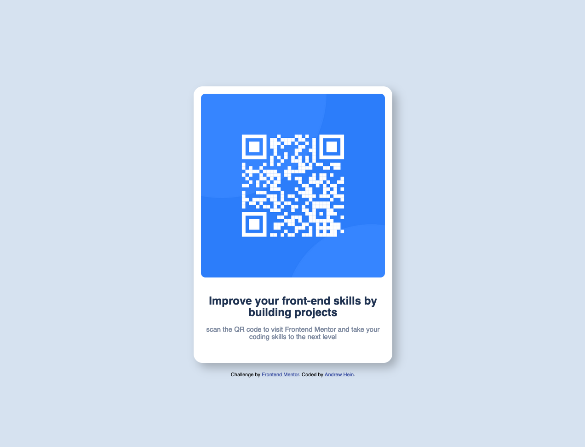

# Frontend Mentor - QR code component solution

This is a solution to the [QR code component challenge on Frontend Mentor](https://www.frontendmentor.io/challenges/qr-code-component-iux_sIO_H). Frontend Mentor challenges help you improve your coding skills by building realistic projects. 

## Table of contents

- [Overview](#overview)
  - [Screenshot](#screenshot)
  - [Links](#links)
- [My process](#my-process)
  - [Built with](#built-with)
  - [What I learned](#what-i-learned)
  - [Continued development](#continued-development)
  - [Useful resources](#useful-resources)
- [Author](#author)
- [Acknowledgments](#acknowledgments)

## Overview

### Screenshot

### Links

- Live Site URL: [Live Site](https://heinz157.github.io/CM_QRCodeComponent/)

## My process

### Built with

- Semantic HTML5 markup
- CSS custom properties
- Flexbox
- CSS Grid
- Mobile-first workflow

### What I learned

I learned a lot about how the CSS flexbox works with multiple components within a div. Also my first time working with figma files so that was a good experience to have with a simple project like this.

### Continued development

I wanted this project to be the start for me to begin diving deeper into what Frontend Mentor has to offer. I plan on continuing to work on the challenges and learning more about the different technologies that are used in the projects.

## Author

- Website - [Andrew Hein](https://www.your-site.com)
- Frontend Mentor - [@Heinz157](https://www.frontendmentor.io/profile/Heinz157)
